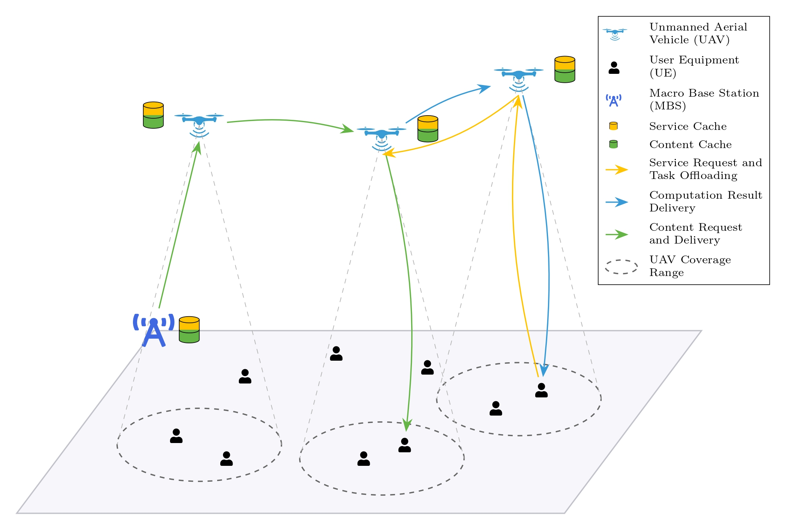

# Multi-UAV Assisted Mobile Edge Computing: A Hybrid Optimization Approach

## Objective

The primary objective of this research is to develop a framework for a multi-UAV-assisted collaborative Mobile Edge Computing (MEC) network. We aim to jointly optimize four interdependent components: task offloading decisions, service caching placement, content caching strategies, and UAV trajectories. The goal is to minimize a weighted sum of service latency and system-wide energy consumption while simultaneously maximizing user fairness.

We are aiming to implement a hybrid optimization approach that combines **multi-agent deep reinforcement learning** with **collaborative and adaptive caching policies**. We are trying to create a generic framework that can be used with different models for finding the best-suited one for our purpose. Also trying to incorporate modern Python practices and type annotations. Developed using Python 3.12.0 and PyTorch 2.8.0.

Currently included MARL models:
- MADDPG (Multi-Agent Deep Deterministic Policy Gradient)
- MATD3 (Multi-Agent Twin Delayed Deep Deterministic Policy Gradient)
- MAPPO (Multi-Agent Proximal Policy Optimization)
- MASAC (Multi-Agent Soft Actor-Critic)
- Random baseline



Directory Structure:

```
.
├── environment
│   ├── comm_model.py
│   ├── env.py
│   ├── uavs.py
│   └── user_equipments.py
├── marl_models
│   ├── base_model.py
│   ├── buffer_and_helpers.py
│   ├── utils.py
│   ├── maddpg
│   │   ├── agents.py
│   │   └── maddpg.py
│   ├── matd3
│   │   ├── agents.py
│   │   └── matd3.py
│   ├── mappo
│   │   ├── agents.py
│   │   └── mappo.py
│   ├── masac
│   │   ├── agents.py
│   │   └── masac.py
│   └── random_baseline
│       └── random_model.py
├── utils
│   ├── logger.py
│   ├── plot_logs.py
│   └── plot_snapshots.py
├── config.py
├── train.py
├── test.py
├── main.py
├── visualize.py
├── requirements.txt
├── README.md
├── .gitignore
└── LICENSE
```

Packages currently required to be installed (can be found in `requirements.txt`):
- torch
- numpy
- matplotlib

## Usage Instructions

- Clone the repository : `git@github.com:Project-Group-BTP/Multi-UAV-Mobile-Edge-Computing-Hybrid-Optimization.git` .
- Create a virtual environment and activate it (preferably Python 3.12+).
- Install requirements using `pip install -r requirements.txt`.

The code has been designed to be modular and extensible. You can easily add new models along the lines of existing models by creating a new folder in `marl_models` with its algorithm and agents. Update the `main.py` file and `get_model` function in `marl_models/utils.py` to include your new model.

Also, the settings and hyperparameters are configurable and can be changed in `config.py`. Please refer to the docs and comments in the file for details.

### Training

It can be used to start training from scratch or resume training from a previously saved checkpoint.

```bash
# Start training from scratch
python main.py train --num_episodes=<total_episodes>

# To resume training from a saved checkpoint, specify no. of additional episodes, path to the saved checkpoint, and path to the saved config file (to load and use the same settings).
python main.py train --num_episodes=<additional_episodes> --resume_path="<path_to_checkpoint_directory>" --config_path="<path_to_saved_config>"
```

### Testing

It can be used to test a saved model for a specified number of episodes.
To test a saved model, you must provide the path to the model's directory and its corresponding configuration file.

```bash
# Start testing, with saved model path and config file saved during that model's training run (to load and use the same settings).
python main.py test --num_episodes=<total_episodes> --model_path="<path_to_model_directory>" --config_path="<path_to_saved_config>"
```

A temporary script to run the environment with random actions and visualize the state for just testing the environment alone. Run using:

```bash
python visualize.py
```

**PS: Currently under rapid development and may be subject to significant changes.**

## Contributors

- Roopam Taneja
- Vraj Tamakuwala

### Made with ❤️
